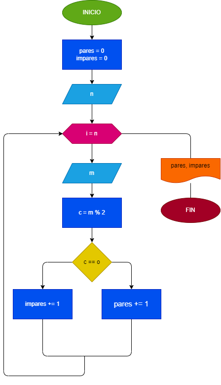
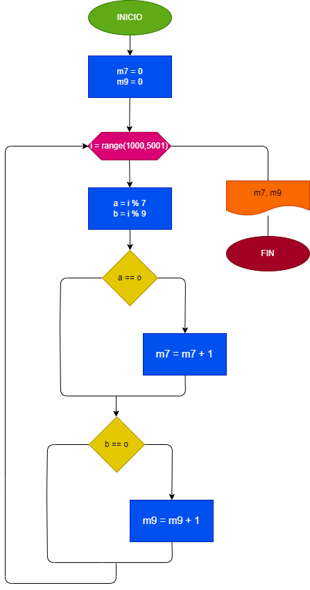
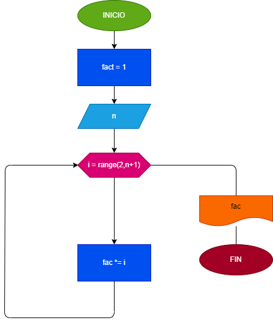

# Ejercicios_For
## Análisis
1. Leer N numeros enterios (uno en cada lectura), mostrar e imprimir cuantos son pares y cuantos son impares.
## Diseño
### Diagrama de Flujo

## Análisis
2. Mostar e imprimir cuantos múltiplos de 7 y cuántos múltiplos de 9 hay entre 1000 y 5000.
## Diseño
### Diagrama de Flujo

## Análisis
3. Simular el lanzamiento de N dados o de un dado N veces, e imprimir cuántas veces cayó cada cara. Mostrar el resultado con barra 
de asterisco.
## Diseño
### Diagrama de Flujo

## Análisis
4. Calcular y mostrar el factorial de un número.
## Diseño
### Diagrama de Flujo

